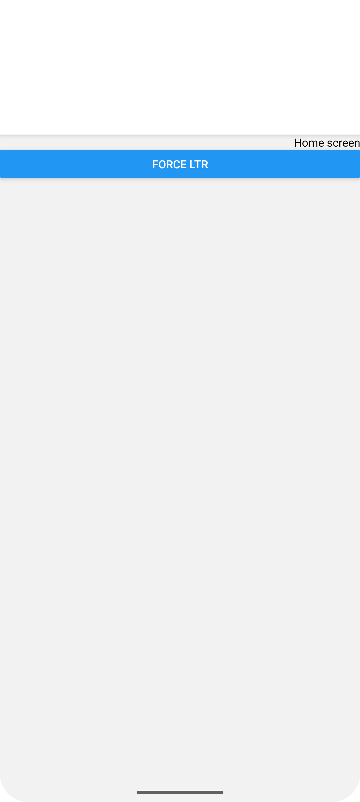
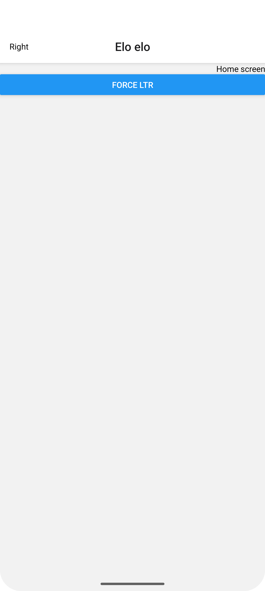
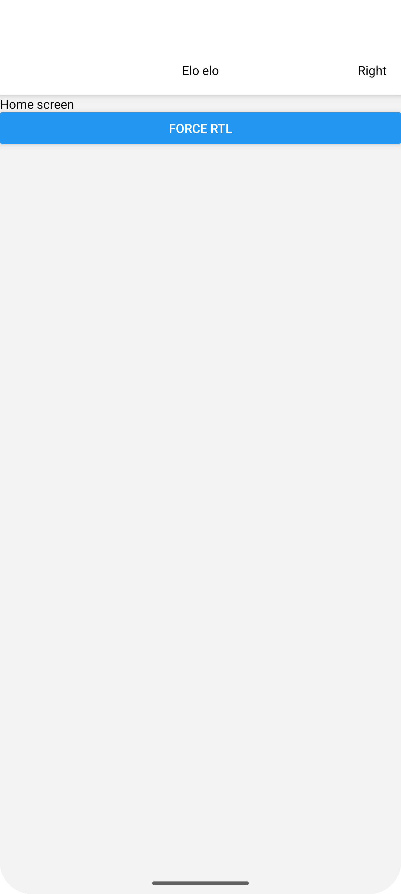

# Title is not displayed when using RTL

In **RTL** mode, if `headerTitleAlign` is set to `center` and `headerTitle` is defined as a function, the title isn’t displayed and the header gains extra spacing. 

```
  <Stack.Navigator 
    screenOptions={{
      headerTitle: () => (
        <View>
          <Text>Elo elo</Text>
        </View>
      ),
      headerRight: () => (
        <View>
          <Text>Right</Text>
        </View>
      ),
      headerTitleAlign: 'center',
    }}
  >
  (...)
  </Stack.Navigator>
```



Interesingly, when `headerTitle` is a string, header is reneded properly also in **RTL** mode.

```
  <Stack.Navigator 
    screenOptions={{
      headerTitle: 'Elo elo',
      headerRight: () => (
        <View>
          <Text>Right</Text>
        </View>
      ),
      headerTitleAlign: 'center',
    }}
  >
  (...)
  </Stack.Navigator>
```



On the other hand, header is rendered properly with both types in **LTR**


